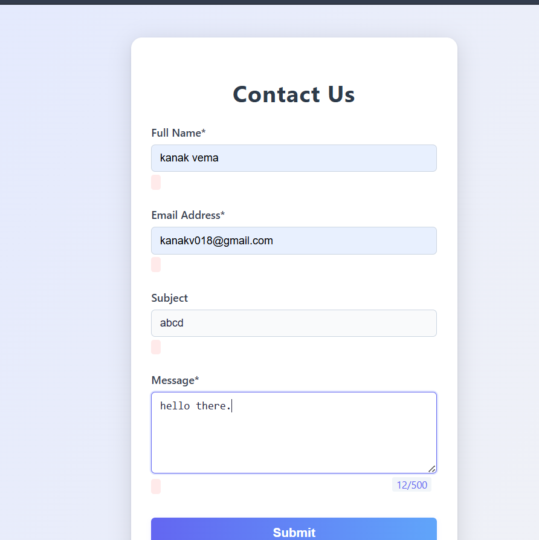

# Client-Side Form Validation

This project is a modern contact form with client-side validation using JavaScript.

## Features
- Full Name (required, min 3 characters)
- Email Address (required, must be valid)
- Subject (optional)
- Message (required, max 500 characters)
- Real-time validation and error messages
- Submit button disabled until form is valid
- Animated loading spinner and simulated loading on submit
- Character counter for message field
- Modern, attractive UI with gradients and card effect
- All fields disabled during submission
- Responsive and accessible design

## Screenshot

## Live Demo

[View Live](https://client-side-form-validation-orpin.vercel.app/)

## How to Run
1. Download or clone this repository.
2. Open `index.html` in your web browser.
3. Fill out the form and test the validation features.

No backend required. All validation is handled in the browser.

---
**To update the screenshot:**
1. Take a screenshot of the form in your browser.
2. Save it as `screenshot.png` in the project root.

**To update the live link:**
- Deploy your project (e.g., GitHub Pages, Vercel, Netlify) and replace the link above. 